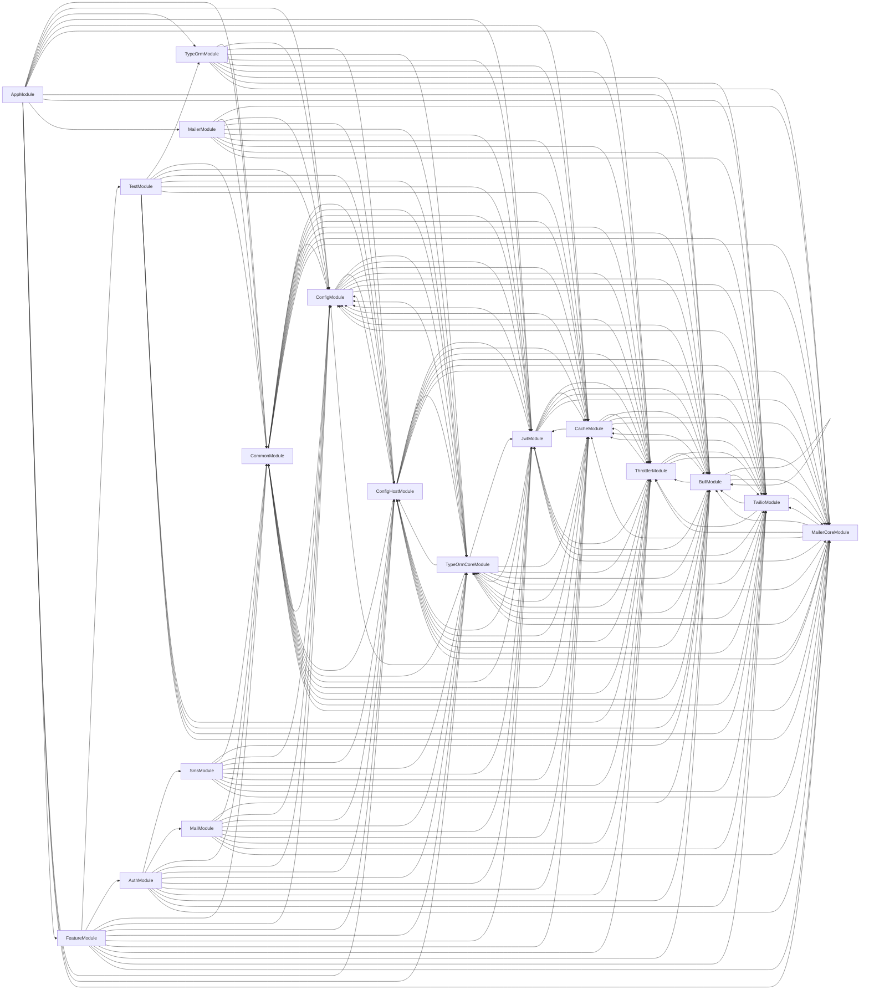

```mermaid
graph LR
  AppModule-->CommonModule
  CommonModule-->ConfigModule
  ConfigModule-->ConfigHostModule
  ConfigHostModule-->CommonModule
  ConfigHostModule-->ConfigModule
  ConfigHostModule-->TypeOrmCoreModule
  TypeOrmCoreModule-->CommonModule
  TypeOrmCoreModule-->ConfigModule
  TypeOrmCoreModule-->ConfigHostModule
  TypeOrmCoreModule-->JwtModule
  JwtModule-->CommonModule
  JwtModule-->ConfigModule
  JwtModule-->ConfigHostModule
  JwtModule-->TypeOrmCoreModule
  JwtModule-->CacheModule
  CacheModule-->CommonModule
  CacheModule-->ConfigModule
  CacheModule-->ConfigHostModule
  CacheModule-->TypeOrmCoreModule
  CacheModule-->JwtModule
  CacheModule-->ThrottlerModule
  ThrottlerModule-->CommonModule
  ThrottlerModule-->ConfigModule
  ThrottlerModule-->ConfigHostModule
  ThrottlerModule-->TypeOrmCoreModule
  ThrottlerModule-->JwtModule
  ThrottlerModule-->CacheModule
  ThrottlerModule-->BullModule
  BullModule-->BullModule
  BullModule-->CommonModule
  BullModule-->ConfigModule
  BullModule-->ConfigHostModule
  BullModule-->TypeOrmCoreModule
  BullModule-->JwtModule
  BullModule-->CacheModule
  BullModule-->ThrottlerModule
  BullModule-->TwilioModule
  TwilioModule-->CommonModule
  TwilioModule-->ConfigModule
  TwilioModule-->ConfigHostModule
  TwilioModule-->TypeOrmCoreModule
  TwilioModule-->JwtModule
  TwilioModule-->CacheModule
  TwilioModule-->ThrottlerModule
  TwilioModule-->BullModule
  TwilioModule-->MailerCoreModule
  MailerCoreModule-->CommonModule
  MailerCoreModule-->ConfigModule
  MailerCoreModule-->ConfigHostModule
  MailerCoreModule-->TypeOrmCoreModule
  MailerCoreModule-->JwtModule
  MailerCoreModule-->CacheModule
  MailerCoreModule-->ThrottlerModule
  MailerCoreModule-->BullModule
  MailerCoreModule-->TwilioModule
  BullModule-->MailerCoreModule
  ThrottlerModule-->TwilioModule
  ThrottlerModule-->MailerCoreModule
  CacheModule-->BullModule
  CacheModule-->TwilioModule
  CacheModule-->MailerCoreModule
  JwtModule-->ThrottlerModule
  JwtModule-->BullModule
  JwtModule-->TwilioModule
  JwtModule-->MailerCoreModule
  TypeOrmCoreModule-->CacheModule
  TypeOrmCoreModule-->ThrottlerModule
  TypeOrmCoreModule-->BullModule
  TypeOrmCoreModule-->TwilioModule
  TypeOrmCoreModule-->MailerCoreModule
  ConfigHostModule-->JwtModule
  ConfigHostModule-->CacheModule
  ConfigHostModule-->ThrottlerModule
  ConfigHostModule-->BullModule
  ConfigHostModule-->TwilioModule
  ConfigHostModule-->MailerCoreModule
  ConfigModule-->CommonModule
  ConfigModule-->TypeOrmCoreModule
  ConfigModule-->JwtModule
  ConfigModule-->CacheModule
  ConfigModule-->ThrottlerModule
  ConfigModule-->BullModule
  ConfigModule-->TwilioModule
  ConfigModule-->MailerCoreModule
  CommonModule-->ConfigHostModule
  CommonModule-->TypeOrmCoreModule
  CommonModule-->JwtModule
  CommonModule-->CacheModule
  CommonModule-->ThrottlerModule
  CommonModule-->BullModule
  CommonModule-->TwilioModule
  CommonModule-->MailerCoreModule
  AppModule-->ConfigModule
  AppModule-->TypeOrmModule
  TypeOrmModule-->CommonModule
  TypeOrmModule-->ConfigModule
  TypeOrmModule-->ConfigHostModule
  TypeOrmModule-->TypeOrmCoreModule
  TypeOrmModule-->JwtModule
  TypeOrmModule-->CacheModule
  TypeOrmModule-->ThrottlerModule
  TypeOrmModule-->BullModule
  TypeOrmModule-->TwilioModule
  TypeOrmModule-->MailerCoreModule
  AppModule-->JwtModule
  AppModule-->CacheModule
  AppModule-->ThrottlerModule
  AppModule-->BullModule
  AppModule-->TwilioModule
  AppModule-->MailerModule
  MailerModule-->MailerCoreModule
  MailerModule-->CommonModule
  MailerModule-->ConfigModule
  MailerModule-->ConfigHostModule
  MailerModule-->TypeOrmCoreModule
  MailerModule-->JwtModule
  MailerModule-->CacheModule
  MailerModule-->ThrottlerModule
  MailerModule-->BullModule
  MailerModule-->TwilioModule
  AppModule-->FeatureModule
  FeatureModule-->TestModule
  TestModule-->TypeOrmModule
  TestModule-->CommonModule
  TestModule-->ConfigModule
  TestModule-->ConfigHostModule
  TestModule-->TypeOrmCoreModule
  TestModule-->JwtModule
  TestModule-->CacheModule
  TestModule-->ThrottlerModule
  TestModule-->BullModule
  TestModule-->TwilioModule
  TestModule-->MailerCoreModule
  FeatureModule-->AuthModule
  AuthModule-->SmsModule
  SmsModule-->BullModule
  SmsModule-->CommonModule
  SmsModule-->ConfigModule
  SmsModule-->ConfigHostModule
  SmsModule-->TypeOrmCoreModule
  SmsModule-->JwtModule
  SmsModule-->CacheModule
  SmsModule-->ThrottlerModule
  SmsModule-->TwilioModule
  SmsModule-->MailerCoreModule
  AuthModule-->MailModule
  MailModule-->BullModule
  MailModule-->CommonModule
  MailModule-->ConfigModule
  MailModule-->ConfigHostModule
  MailModule-->TypeOrmCoreModule
  MailModule-->JwtModule
  MailModule-->CacheModule
  MailModule-->ThrottlerModule
  MailModule-->TwilioModule
  MailModule-->MailerCoreModule
  AuthModule-->CommonModule
  AuthModule-->ConfigModule
  AuthModule-->ConfigHostModule
  AuthModule-->TypeOrmCoreModule
  AuthModule-->JwtModule
  AuthModule-->CacheModule
  AuthModule-->ThrottlerModule
  AuthModule-->BullModule
  AuthModule-->TwilioModule
  AuthModule-->MailerCoreModule
  FeatureModule-->CommonModule
  FeatureModule-->ConfigModule
  FeatureModule-->ConfigHostModule
  FeatureModule-->TypeOrmCoreModule
  FeatureModule-->JwtModule
  FeatureModule-->CacheModule
  FeatureModule-->ThrottlerModule
  FeatureModule-->BullModule
  FeatureModule-->TwilioModule
  FeatureModule-->MailerCoreModule
  AppModule-->ConfigHostModule
  AppModule-->TypeOrmCoreModule
  AppModule-->MailerCoreModule
```